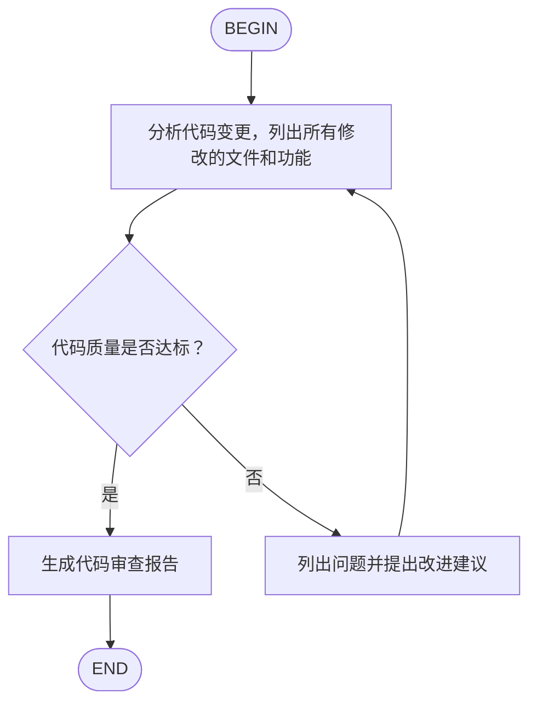
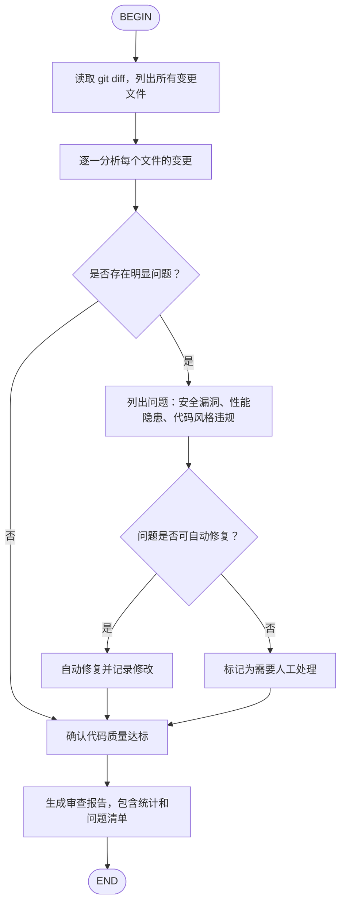

# Kimi Code Skills 完整说明

Skills 是 Kimi Code CLI 的知识扩展机制，通过 `SKILL.md` 文件定义专业知识和自动化工作流。

---

## Skills 分层加载

Kimi Code 按优先级发现 Skills：**Project > User > Extra > Built-in**。同名 Skill 更具体的 scope 优先。

### 内置 Skills（最低优先级）

随 CLI 包安装：
- `kimi-code-help`：Kimi Code 使用帮助
- `skill-creator`：Skill 创建指南

### 用户级 Skills

**品牌组**（互斥选一，`merge_all_available_skills=true` 时全部加载）：
1. `~/.kimi-code/skills/`
2. `~/.claude/skills/`
3. `~/.codex/skills/`

**通用组**（互斥选一）：
1. `~/.config/agents/skills/`（推荐）
2. `~/.agents/skills/`

两组分别选出目录后合并。品牌组同名 Skill 优先级：kimi-code > claude > codex。

### 项目级 Skills

**品牌组**：
1. `.kimi-code/skills/`
2. `.claude/skills/`
3. `.codex/skills/`

**通用组**：`.agents/skills/`

### 额外目录

```toml
# config.toml
extra_skill_dirs = [
    "~/my-skills",           # ~ 展开为 $HOME
    ".claude/plugins/skills", # 相对路径相对于项目根目录
    "/opt/team-shared/skills", # 绝对路径
]
```

### CLI 参数覆盖

```sh
kimi-code --skills-dir /path/to/skills --skills-dir /path/to/more
```

指定后替代自动发现，不叠加。

---

## Skill 目录结构

### 标准格式（子目录）

```
my-skill/
├── SKILL.md          # 必需
├── scripts/          # 可选：脚本文件
├── references/       # 可选：参考文档
└── assets/           # 可选：其他资源
```

### 扁平格式（单文件）

```
my-skill.md           # 直接放在 skills 目录下
```

如果同名子目录和 `.md` 文件同时存在，子目录优先。

---

## SKILL.md 格式

### 普通 Skill

```markdown
---
name: code-style
description: 我的项目代码风格规范
---

## 代码风格

- 使用 4 空格缩进
- 变量名使用 camelCase
```

### Frontmatter 字段

| 字段 | 说明 | 必填 |
|------|------|------|
| `name` | 1-64 字符，小写字母/数字/连字符；默认取目录名 | 否 |
| `description` | 1-1024 字符；默认取正文首行（截断 240 字符）或 "No description provided." | 否 |
| `type` | `"flow"` 表示 Flow Skill | 否 |
| `license` | 许可证名称或文件引用 | 否 |
| `compatibility` | 环境要求，最多 500 字符 | 否 |
| `metadata` | 额外键值对 | 否 |
| `whenToUse` | **新增**：触发条件描述，帮助 Agent 判断何时使用 | 否 |
| `disableModelInvocation` | **新增**：`true` 时禁止 Agent 自动加载此 Skill | 否 |
| `arguments` | **新增**：Skill 接受的参数定义 | 否 |

### 新增字段详解

**`whenToUse`**：用自然语言描述触发条件，Agent 读取 description 后据此判断是否需要加载 Skill。比 description 更具体地描述"什么情况下该用"。

```yaml
whenToUse: |
  当用户要求搜索中文学术论文、查询知网文献、查找中文期刊时触发。
  不适用于英文论文检索（用 paper-assistant）。
```

**`disableModelInvocation`**：设为 `true` 时，Agent 不会自动判断加载此 Skill，只能通过 `/skill:<name>` 手动调用。适用于副作用大或开销高的 Skill。

**`arguments`**：定义 Skill 接受的参数，帮助 Agent 正确传递参数。

```yaml
arguments:
  query:
    type: string
    description: 搜索关键词
    required: true
  limit:
    type: number
    description: 返回结果数量
    default: 10
```

### 最佳实践

- SKILL.md 控制在 500 行以内，详细内容放 `references/`
- 用相对路径引用同目录下的其他文件
- 提供清晰的步骤、输入输出示例、边界情况说明
- 使用 `whenToUse` 帮助 Agent 在合适的时机自动加载

---

## Flow Skills

Flow Skill 是内嵌状态机的自动化工作流。新版 Kimi Code 中统一通过 `/skill:<name>` 调用（不再有 `/flow:` 命名空间），Flow 类型 Skill 调用时由 FlowRunner 接管执行。

### 创建 Flow Skill

Frontmatter 中设 `type: flow`，内容中包含 Mermaid 或 D2 流程图。

### Mermaid 格式

````markdown
---
name: code-review
description: 代码审查工作流
type: flow
---


````

### D2 格式

````markdown
---
name: deploy
description: 部署工作流
type: flow
---

```d2
BEGIN -> build -> test -> deploy -> END
build: 执行构建命令，检查编译是否通过
test: 运行测试套件
test -> build: 测试失败
deploy: 部署到生产环境
```
````

### 流程图语法规则

1. **必须包含**一个 `BEGIN` 节点和一个 `END` 节点
2. **普通节点**文本作为提示词发送给 Agent
3. **分支节点**（菱形 `{}`）需要 Agent 输出 `<choice>分支名</choice>` 选择路径
4. Mermaid 用 `-->|标签|` 定义分支标签，D2 用 `-> 目标: 条件`
5. D2 多行标签用块字符串 `|md`：

```d2
step: |md
  # 标题
  1. 第一步
  2. 第二步
|
```

### 调用方式

```
# 执行 Flow Skill（自动按图执行）
/skill:code-review

# 仅加载 SKILL.md 内容（不自动执行，等同于普通 Skill）
# Flow 类型 Skill 调用时由 FlowRunner 接管，无法选择"只加载不执行"
```

**关键变化：** 新版不再有 `/flow:<name>` 命令。所有 Skill 统一通过 `/skill:<name>` 调用，Flow 类型自动走 FlowRunner。

### 执行机制

Flow 引擎的核心行为：

1. **每步都是一次标准对话 turn**：复用完整的工具、context、compaction 机制
2. **task 节点不验证输出**：LLM 回复后无条件走唯一出边
3. **decision 节点自动重试**：`<choice>` 匹配失败时追加提示重试，不会静默跳过
4. **`max_moves` 默认 1000**：防止无限循环，每次经过 task/decision 节点算一次

### 解析失败降级

如果 SKILL.md 声明了 `type: flow` 但 Mermaid/D2 解析失败，skill 降级为 `type: standard`，FlowRunner 不会接管，Skill 内容直接注入对话上下文。

### 校验规则

1. 恰好 1 个 BEGIN 节点
2. 恰好 1 个 END 节点
3. END 必须从 BEGIN 可达（BFS 遍历）
4. 多出边节点（>1 条出边）的每条边必须有非空 label
5. 多出边节点的边 label 不能重复

### 节点类型推断

| 条件 | 推断类型 |
|------|----------|
| label 规范化后等于 `"begin"` | `begin` |
| label 规范化后等于 `"end"` | `end` |
| 只有 1 条出边 | `task` |
| 有 2 条以上出边 | `decision` |

菱形括号 `{}` 只影响 Mermaid 渲染，不影响类型推断。

### `<choice>` 匹配细节

正则 `r"<choice>([^<]*)</choice>"`，取文本中**最后一个**匹配（防止正文中提到 `<choice>` 导致误匹配）。匹配后的选择与边 label 做**精确字符串比较**。

---

## Flow Skills 使用技巧

### Flow 的调用路径

新版只有一个入口：`/skill:<name>`。Flow 类型 Skill 调用时由 FlowRunner 按图执行，BEGIN→task→decision→END。非 Flow 类型 Skill 直接将 SKILL.md 注入对话上下文。

### decision 节点的自动重试机制

当 Agent 在 decision 节点的回复中没有输出 `<choice>分支名</choice>` 时，FlowRunner **不会静默跳过**，而是自动追加提示并重试：

```
Your last response did not include a valid choice. 
Reply with one of the choices using <choice>...</choice>.
```

这意味着：
- 不需要在 decision 节点的 prompt 里反复强调"必须用 `<choice>` 格式"——FlowRunner 会自动追加这个要求
- 但为了减少重试次数、节省 token，最好还是在节点文本里提一句"完成后用 `<choice>分支名</choice>` 选择下一步"
- 如果 Agent 反复匹配失败，会一直重试直到 `max_moves` 耗尽。所以**分支标签要简短精确**，避免用长句或容易写错的词

### `<choice>` 的匹配规则

取的是文本中**最后一个** `<choice>...</choice>`，然后用精确字符串比较。

这意味着：
- Agent 在正文中提到 `<choice>` 不会干扰匹配（取最后一个，通常 Agent 会把 choice 放在回复末尾）
- 但如果你在节点文本的示例中写了 `<choice>示例</choice>`，Agent 可能照抄，导致匹配到错误分支。**不要在 prompt 里放 `<choice>` 的字面示例**
- 分支标签中的空格、大小写都必须完全一致。建议用全大写的单词（如 `CONTINUE`、`STOP`、`FIX`、`SKIP`）减少拼写错误

### task 节点不检查输出

task 节点的 LLM 回复内容不被解析、不被验证。Agent 执行完 task 后**无条件走唯一出边**。这意味着：
- task 节点的 prompt 必须足够自包含，让 Agent 知道产出应该是什么
- 如果需要验证 task 的输出质量，应该把验证逻辑放在下一个节点中
- 如果 task 可能失败，应该紧跟一个 decision 节点让 Agent 判断是否继续

### 流程设计建议

1. **BEGIN 后第一个节点放上下文收集**：让 Agent 先读相关文件、了解现状，再做后续决策
2. **decision 分支不超过 3 个**：分支太多 Agent 容易选错，匹配失败重试也浪费 token
3. **END 前放汇总节点**：把整个流程的产出汇总成一份报告，方便后续引用
4. **利用回边做循环**：Mermaid 中 `E --> B` 可以形成迭代循环，但注意设好退出条件（通过 decision 节点），否则会跑到 `max_moves` 耗尽
5. **max_moves 默认 1000**：每次经过 task/decision 节点算一次 move，循环设计时确保能在 1000 步内收敛

### Flow 与子 Agent 配合

FlowRunner 的每一步都调用标准 turn，这意味着 Flow 执行期间 Agent 可以使用全部工具，包括启动子 Agent。

可以利用这个特性：
- 在 task 节点中启动 explore agent 做代码库调研，等结果后继续
- 在 decision 节点中根据子 Agent 的返回结果选择分支
- 注意：子 Agent 的超时和 Flow 的 max_moves 是独立的两套限制，子 Agent 超时不会中断 Flow

### 常见错误

| 错误 | 原因 | 修正 |
|------|------|------|
| `/skill:xxx` 对 Flow Skill 不生效 | Mermaid/D2 解析失败，skill 被降级为 standard | 检查图语法，确认 1 BEGIN + 1 END + 全可达 + 分支边有 label |
| Flow 卡在某个节点不动 | decision 的 `<choice>` 匹配失败，正在自动重试 | 检查分支标签是否精确匹配（空格、大小写） |
| 循环不停止 | 回边没有设退出条件 | 回边必须经过 decision 节点，且有一个指向 END 的分支 |
| Agent 选择了错误的分支 | 分支标签不够清晰，或 prompt 中有误导性的 `<choice>` 字面示例 | 用简短精确的标签，不要在 prompt 中写 `<choice>` 示例 |

---

## Skills vs Plugin

| | Skills | Plugin |
|------|--------|---------|
| 定义文件 | `SKILL.md` | `kimi.plugin.json` |
| 作用 | 知识性指导 | Skills + MCP server 捆绑 |
| AI 使用方式 | 读取并遵循规范 | 自动发现 Skill + MCP 工具 |
| 适合场景 | 代码风格、工作流、最佳实践 | 封装完整功能（如搜索+格式化） |
| 安装位置 | 项目/用户 skill 目录 | `$KIMI_CODE_HOME/plugins/`（仅用户级） |

---

## 完整示例

### 示例 1：Python 项目规范

```markdown
---
name: python-project
description: Python 项目开发规范
whenToUse: 当涉及 Python 项目开发、代码风格、依赖管理时使用
---

## Python 开发规范

- Python 3.14+
- ruff 格式化 + lint
- pyright 类型检查
- pytest 测试
- uv 依赖管理

代码风格：
- 行长度 100 字符
- 使用类型注解
- 公开函数需要 docstring
```

### 示例 2：Git 提交规范

```markdown
---
name: git-commits
description: Conventional Commits 格式的 Git 提交规范
---

## Git 提交规范

格式：类型(范围): 描述

类型：feat, fix, docs, style, refactor, test, chore

示例：
- feat(auth): 添加 OAuth 登录支持
- fix(api): 修复用户查询返回空值
```

### 示例 3：完整 Flow Skill（代码审查）

````markdown
---
name: code-review-flow
description: 自动化代码审查工作流
type: flow
---


````

---

## 新旧 Skills 系统对照

| 旧版 Kimi CLI | 新版 Kimi Code | 说明 |
|--------------|---------------|------|
| `/flow:<name>` | `/skill:<name>` | Flow Skills 统一入口 |
| Frontmatter 6 个字段 | Frontmatter 9 个字段 | 新增 `whenToUse`、`disableModelInvocation`、`arguments` |
| Skills 目录 `~/.kimi/skills/` | `~/.kimi-code/skills/` | 路径变更 |
| 项目级 `.kimi/skills/` | `.kimi-code/skills/` | 路径变更 |
| Plugin 附带 Skill 为根目录单文件 | Plugin 附带 Skill 为 `skills/` 子目录 | 结构变化 |