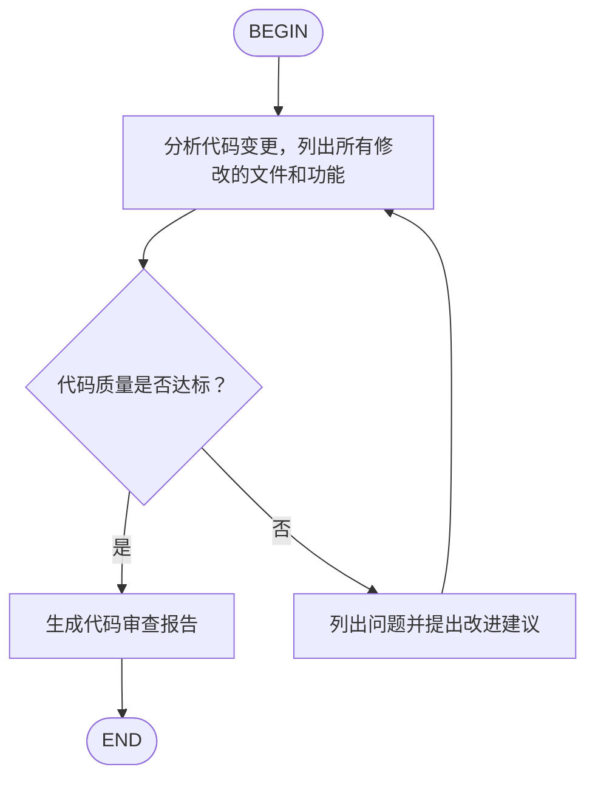
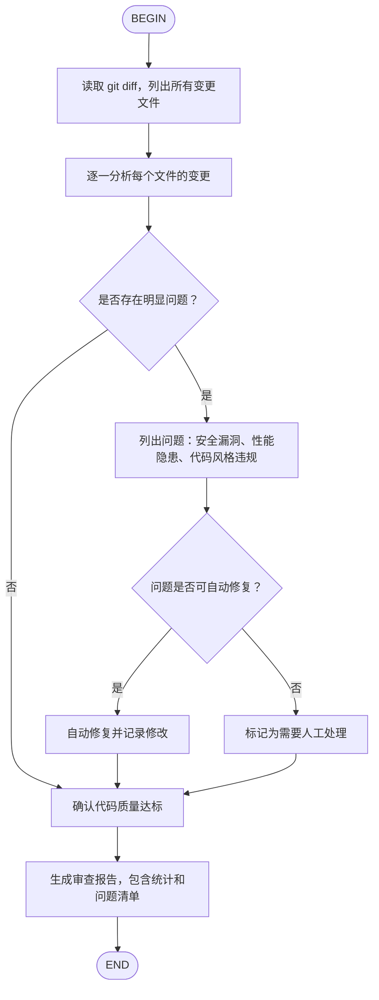

# Kimi CLI Skills 完整说明

Skills 是 Kimi CLI 的知识扩展机制，通过 `SKILL.md` 文件定义专业知识和自动化工作流。

---

## Skills 分层加载

Kimi CLI 按优先级发现 Skills：**Project > User > Extra > Built-in**。同名 Skill 更具体的 scope 优先。

### 内置 Skills（最低优先级）

随 CLI 包安装：
- `kimi-cli-help`：Kimi CLI 使用帮助
- `skill-creator`：Skill 创建指南

### 用户级 Skills

**品牌组**（互斥选一，`merge_all_available_skills=true` 时全部加载）：
1. `~/.kimi/skills/`
2. `~/.claude/skills/`
3. `~/.codex/skills/`

**通用组**（互斥选一）：
1. `~/.config/agents/skills/`（推荐）
2. `~/.agents/skills/`

两组分别选出目录后合并。品牌组同名 Skill 优先级：kimi > claude > codex。

### 项目级 Skills

**品牌组**：
1. `.kimi/skills/`
2. `.claude/skills/`
3. `.codex/skills/`

**通用组**：`.agents/skills/`

### 额外目录

```toml
# config.toml
extra_skill_dirs = [
    "~/my-skills",           # ~ 展开为 $HOME
    ".claude/plugins/skills", # 相对路径相对于项目根目录
    "/opt/team-shared/skills", # 绝对路径
]
```

### CLI 参数覆盖

```sh
kimi --skills-dir /path/to/skills --skills-dir /path/to/more
```

指定后替代自动发现，不叠加。

---

## Skill 目录结构

### 标准格式（子目录）

```
my-skill/
├── SKILL.md          # 必需
├── scripts/          # 可选：脚本文件
├── references/       # 可选：参考文档
└── assets/           # 可选：其他资源
```

### 扁平格式（单文件）

```
my-skill.md           # 直接放在 skills 目录下
```

如果同名子目录和 `.md` 文件同时存在，子目录优先。

---

## SKILL.md 格式

### 普通 Skill

```markdown
---
name: code-style
description: 我的项目代码风格规范
---

## 代码风格

- 使用 4 空格缩进
- 变量名使用 camelCase
```

### Frontmatter 字段

| 字段 | 说明 | 必填 |
|------|------|------|
| `name` | 1-64 字符，小写字母/数字/连字符；默认取目录名 | 否 |
| `description` | 1-1024 字符；默认取正文首行（截断 240 字符）或 "No description provided." | 否 |
| `type` | `"flow"` 表示 Flow Skill | 否 |
| `license` | 许可证名称或文件引用 | 否 |
| `compatibility` | 环境要求，最多 500 字符 | 否 |
| `metadata` | 额外键值对 | 否 |

### 最佳实践

- SKILL.md 控制在 500 行以内，详细内容放 `references/`
- 用相对路径引用同目录下的其他文件
- 提供清晰的步骤、输入输出示例、边界情况说明

---

## Flow Skills

Flow Skill 是内嵌状态机的自动化工作流。与普通 Skill 不同，它通过 `/flow:<name>` 调用后会自动执行多个对话轮次。

### 创建 Flow Skill

Frontmatter 中设 `type: flow`，内容中包含 Mermaid 或 D2 流程图。

### Mermaid 格式

````markdown
---
name: code-review
description: 代码审查工作流
type: flow
---


````

### D2 格式

````markdown
---
name: deploy
description: 部署工作流
type: flow
---

```d2
BEGIN -> build -> test -> deploy -> END
build: 执行构建命令，检查编译是否通过
test: 运行测试套件
test -> build: 测试失败
deploy: 部署到生产环境
```
````

### 流程图语法规则

1. **必须包含**一个 `BEGIN` 节点和一个 `END` 节点
2. **普通节点**文本作为提示词发送给 Agent
3. **分支节点**（菱形 `{}`）需要 Agent 输出 `<choice>分支名</choice>` 选择路径
4. Mermaid 用 `-->|标签|` 定义分支标签，D2 用 `-> 目标: 条件`
5. D2 多行标签用块字符串 `|md`：

```d2
step: |md
  # 标题
  1. 第一步
  2. 第二步
|
```

### 调用方式

```sh
# 自动执行流程
/flow:code-review

# 只加载不自动执行（等同于普通 Skill）
/skill:code-review
```

### 执行机制（源码层面）

Flow 引擎的核心类是 `FlowRunner`（`kimi_cli/soul/kimisoul.py`），约 170 行。关键行为：

1. **每步都是一次标准对话 turn**：`_flow_turn()` 直接调用 `soul._turn()`，复用完整的工具、context、compaction 机制
2. **task 节点不验证输出**：LLM 回复后无条件走唯一出边
3. **decision 节点自动重试**：`<choice>` 匹配失败时追加提示重试，不会静默跳过
4. **`max_moves` 默认 1000**：防止无限循环，每次经过 task/decision 节点算一次

两个命令的注册逻辑（`_build_slash_commands()`）：
- 第一轮遍历：所有 skill 注册 `/skill:<name>`（包括 flow 类型）
- 第二轮遍历：只对 `type == "flow"` 且 `flow is not None` 的 skill 注册 `/flow:<name>`

### 解析失败降级

如果 SKILL.md 声明了 `type: flow` 但 Mermaid/D2 解析失败，skill 降级为 `type: standard`，`flow` 字段设为 `None`。降级后 `/flow:<name>` 不会注册，但 `/skill:<name>` 仍可用。

### 校验规则（`validate_flow()`）

1. 恰好 1 个 BEGIN 节点
2. 恰好 1 个 END 节点
3. END 必须从 BEGIN 可达（BFS 遍历）
4. 多出边节点（>1 条出边）的每条边必须有非空 label
5. 多出边节点的边 label 不能重复

### 节点类型推断

| 条件 | 推断类型 |
|------|----------|
| label 规范化后等于 `"begin"` | `begin` |
| label 规范化后等于 `"end"` | `end` |
| 只有 1 条出边 | `task` |
| 有 2 条以上出边 | `decision` |

菱形括号 `{}` 只影响 Mermaid 渲染，不影响类型推断。

### `<choice>` 匹配细节

正则 `r"<choice>([^<]*)</choice>"`，取文本中**最后一个**匹配（防止正文中提到 `<choice>` 导致误匹配）。匹配后的选择与边 label 做**精确字符串比较**。

---

## 斜杠命令

### `/skill:<name>`

加载 Skill 的 SKILL.md 内容作为提示词发送给 Agent。可附带额外文本：

```
/skill:git-commits 修复用户登录问题
```

### `/flow:<name>`

执行 Flow Skill 的自动化流程。Agent 从 BEGIN 节点开始按图执行直到 END。

### 自动加载

普通对话中 Agent 会根据上下文自动判断是否需要读取 Skill 内容，不需要手动 `/skill:`。

---

## Skills vs Plugins

| | Skills | Plugins |
|------|--------|---------|
| 定义文件 | `SKILL.md` | `plugin.json` |
| 作用 | 知识性指导 | 可执行工具 |
| AI 使用方式 | 读取并遵循规范 | 直接调用工具 |
| 适合场景 | 代码风格、工作流、最佳实践 | 脚本封装、API 调用、数据库查询 |

---

## 完整示例

### 示例 1：Python 项目规范

```markdown
---
name: python-project
description: Python 项目开发规范
---

## Python 开发规范

- Python 3.14+
- ruff 格式化 + lint
- pyright 类型检查
- pytest 测试
- uv 依赖管理

代码风格：
- 行长度 100 字符
- 使用类型注解
- 公开函数需要 docstring
```

### 示例 2：Git 提交规范

```markdown
---
name: git-commits
description: Conventional Commits 格式的 Git 提交规范
---

## Git 提交规范

格式：类型(范围): 描述

类型：feat, fix, docs, style, refactor, test, chore

示例：
- feat(auth): 添加 OAuth 登录支持
- fix(api): 修复用户查询返回空值
```

### 示例 3：PPT 制作

```markdown
---
name: pptx
description: 创建和编辑 PowerPoint 演示文稿
---

## PPT 制作流程

1. 分析内容结构，规划幻灯片大纲
2. 选择合适的配色方案和字体
3. 使用 python-pptx 库生成 .pptx 文件

设计原则：
- 每页聚焦一个主题
- 文字简洁，使用要点而非长段落
- 配色统一，不超过 3 种主色
```

### 示例 4：完整 Flow Skill（代码审查）

````markdown
---
name: code-review-flow
description: 自动化代码审查工作流
type: flow
---


````